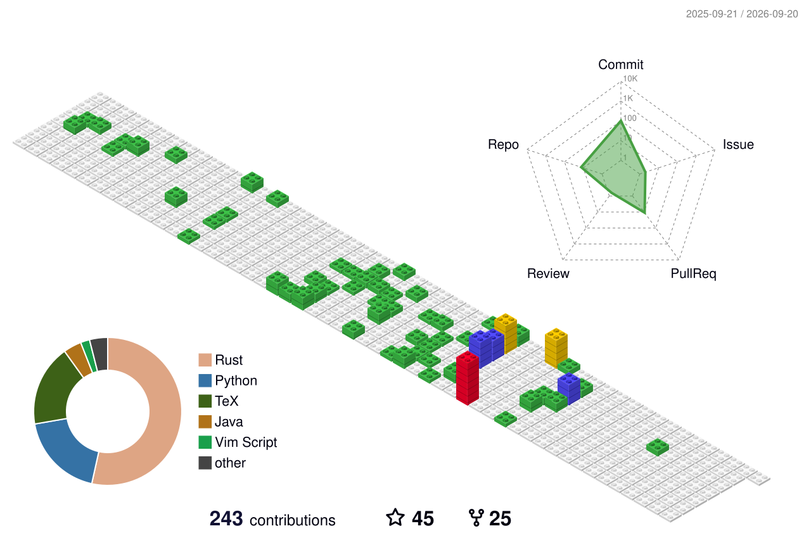

<h1 align="center">Hi 👋, I'm Vector</h1>
<h3 align="center">Assistant Professor at Saint Petersburg State University · PhD in Applied Mathematics</h3>

- 🔬 I research **graph algorithms, centrality measures, explainable AI, and data compression.**

- 💬 Ask me about **anything.**

- 🚀 Check out my open source work:
   - **[ShapG](https://github.com/vectorsss/shapG)** — feature importance based on Shapley values 
   - **[Helium](https://github.com/vectorsss/helium-columnar)** — a columnar compression framework in Rust.

- 📫 How to reach me **vectors@z.org**

<h3 align="left">Connect with me:</h3>

  
  
  
  

<h3 align="left">Languages and Tools:</h3>

  
  

  
  
  
  
  

  
  
  
  
  
  
  
  
  

